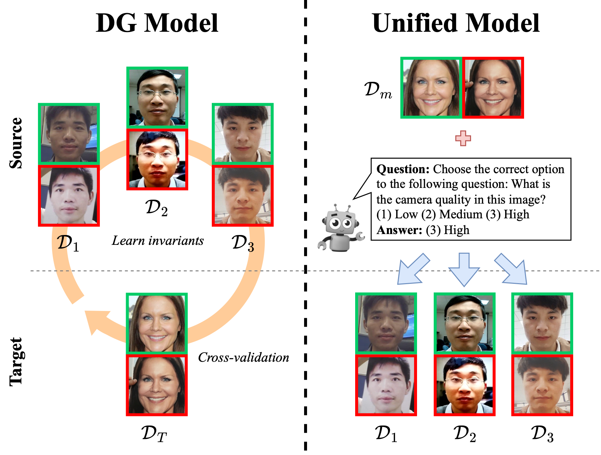
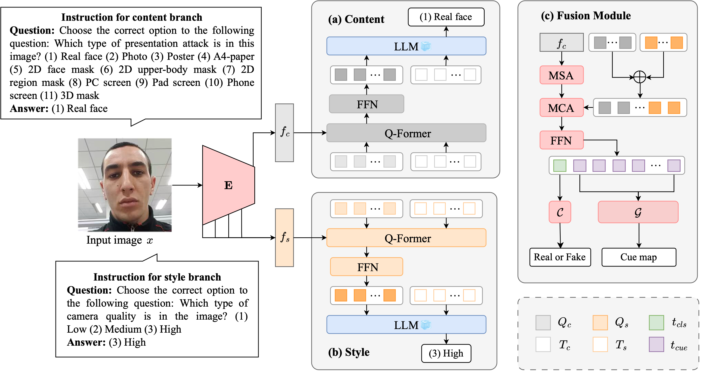

<div align="center">
<h2>InstructFLIP: Exploring Unified Vision-Language Model for Face Anti-spoofing</h2>
<h3>ACM MM 2025</h3>

Kun-Hsiang Lin<sup>1</sup>&nbsp; Yu-Wen Tseng<sup>1</sup>&nbsp; Kang-Yang Huang<sup>1</sup>&nbsp; Jhih-Ciang Wu<sup>2</sup>&nbsp; Wen-Huang Cheng<sup>1</sup>

<sup>1</sup> National Taiwan University&nbsp; <sup>2</sup> National Taiwan Normal University

[]()&nbsp; []()&nbsp; [](https://kunkunlin1221.github.io/InstructFLIP/)



</div>

**Overview:** InstructFLIP is a unified instruction-tuned framework that leverages vision-language models and a meta-domain strategy to achieve efficient face anti-spoofing generalization without redundant cross-domain training.

## Highlights



- This paper proposes InstructFLIP, a novel instruction-tuned VLM framework for FAS, which integrates textual supervision to enhance semantic understanding of spoofing cues.
- We design a content-style decoupling mechanism that explicitly separates spoof-related (content) and spoof-irrelevant (style) information, improving generalization to unseen domains.
- We introduce a meta-domain learning strategy to eliminate training redundancy in cross-domain settings by utilizing diverse image-instruction pairs sampled from a structured meta-domain.
- Experimental results demonstrate that InstructFLIP surpasses SOTA methods across multiple FAS benchmarks, effectively capturing spoof-related patterns through language-guided supervision while substantially reducing training overhead, thereby enhancing its applicability in real-world scenarios.

## Instruction for code usage

We recommend using Docker to run the code, which can ensure a consistent environment across different machines.

### Clone the repository

Install [git-lfs](https://git-lfs.github.com/) first, then clone the repository:

```bash
git clone https://github.com/kunkunlin1221/InstructFLIP.git
```

### Prepare the dataset

see [data_preprocess/README.md](data_preprocess/README.md)

### Training

#### 1. Build the Docker image

```bash
cd docker
bash build.sh
cd ..
```

#### 2. Train the SOTA InstructFLIP

```bash
bash docker/run.sh scripts/train_instruct_flip.sh
```

### Ablations

#### Loss weights

```bash
bash docker/run.sh ablations/loss/$Ablation_Settings.sh # Ablation_Settings: The script name in ablations/loss
```

#### Data

```bash
bash docker/run.sh ablations/data/$Ablation_Settings.sh # Ablation_Settings: The script name in ablations/data
```

#### Branch

```bash
bash docker/run.sh ablations/data/train_intruct_flip_$Ablation_Settings.sh # Ablation_Settings: The script name in ablations/branch
```

#### Replace llm with multi-classes heads

```bash
bash docker/run.sh ablations/data/train_mc.sh
```

## Citation

If you're using this work in your research or applications, please cite using this BibTeX:

```bibtex
@InProceedings{lin2025instructflip,
  author    = {Kun-Hsiang Lin and Yu-Wen Tseng and Kang-Yang Huang and Jhih-Ciang Wu and Wen-Huang Cheng},
  title     = {InstructFLIP: Exploring Unified Vision-Language Model for Face Anti-spoofing},
  booktitle = {Proceedings of the 33rd ACM International Conference on Multimedia},
  year      = {2025},
  organization = {ACM},
}
```
